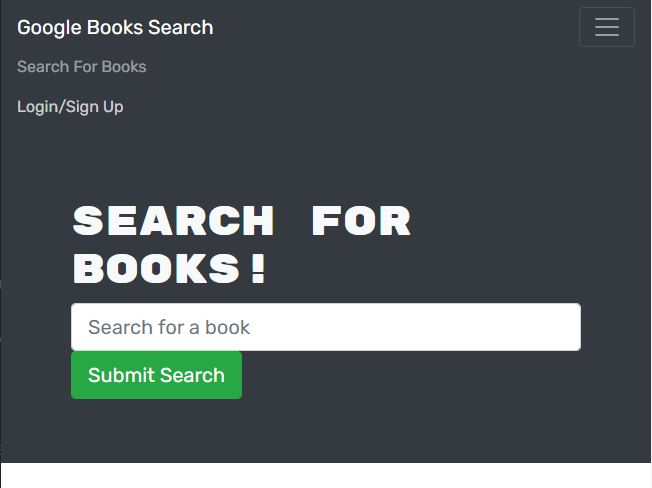

# Book Search Engine Starter Code

## Description
    AS AN avid reader, I WANT to search for new books to read
    SO THAT I can keep a list of books to purchase

---

## Table of Contents
- [Usage](#usage)
- [First-Look](#first-look)
- [Contributing](#contributing)
- [Questions](#questions)

---

## Usage
- To have one place to store all the books you have read or want to read

## First Look

## Website
https://obscure-ravine-65798.herokuapp.com/

## Contributing
- Third-party Assets: GraphQL, React, Apollo, Express, Concurrently, Mongoose, Jsonwebtoken, BootStrap

## Questions
>Aimee Truong
>
>[My GitHub Profile](https://github.com/aimtruong)
>
>Email me at aimtruong@ucdavis.edu if you have any additional questions!

    
